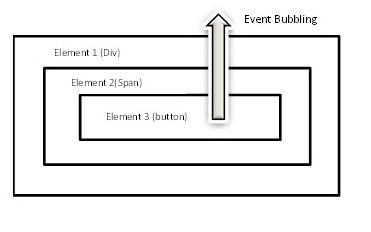

# Event Bubbling



### En

Event bubbling is a type of event propagation where the event triggers the innermost target element first and then repeatedly triggers the ancestors of the target element in the same nesting hierarchy until it reaches the outermost DOM element or document object. It is a way of handling events in the browser. Wikipedia (English)

In this example, there is a form in the 1st popup, and any click outside of the form causes the popup to be closed by the onClick event assigned to the popup.

In the 2nd example, there is a form that does not have the onClick event set, and in this case, wherever you click on the screen, the popup will be closed.

```javascript
Event.stopPropagation();
```

> The stopPropagation() method of the Event interface prevents further
> propagation of the current event in the capturing and bubbling
> phases. It does not, however, prevent any default behaviors from
> occurring; for instance, clicks on links are still processed.
> [developer.mozilla.org](https://developer.mozilla.org/en-US/docs/Web/API/Event/stopPropagation)

### Tr

JavaScript Event Bubbling
Olay köpürme, olayın ilk önce en içteki hedef öğeyi tetiklediği ve daha sonra aynı iç içe yerleştirme hiyerarşisindeki hedef öğenin atalarını en dıştaki DOM öğesine veya belge nesnesine ulaşana kadar art arda tetiklediği bir tür olay yayılımıdır. Olayların tarayıcıda ele alınmasının bir yoludur. Wikipedia (İngilizce)

Bu örnekte 1.popupda bir form var ve form dışında tıklanan herhangi bir yer popupun kapanmasını sağlıyor bunu sağlayan şey popupa atanmış olan onClick event'ı dır

2.örnekte onClick eventı atanmamış bir form var ve bu durmda ekranda nerye tıklarsanız tıklayın popup kapanacaktır.

```javascript
Event.stopPropagation();
```

> Event arabiriminin stopPropagation() yöntemi, geçerli olayın
> yakalama ve köpürme aşamalarında daha fazla yayılmasını önler.
> Ancak, herhangi bir varsayılan davranışın oluşmasını engellemez;
> örneğin, bağlantılara yapılan tıklamalar hala işlenir.
> [developer.mozilla.org](https://developer.mozilla.org/en-US/docs/Web/API/Event/stopPropagation)
